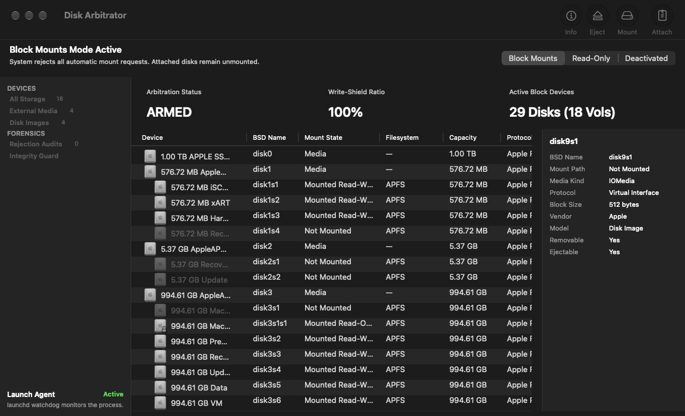

# Disk Arbitrator

Disk Arbitrator is a macOS forensic utility designed to help users ensure correct forensic procedures are followed during imaging and examination of block storage devices. 

Disk Arbitrator acts as an interface to the macOS Disk Arbitration framework, which enables programs to participate in the management of block storage devices—including automatic mounting of file systems. When enabled, Disk Arbitrator intercepts and blocks automatic file system mounts, preventing disks from mounting read-write and preserving evidentiary integrity.

> **Important Forensic Notice**: Disk Arbitrator is *not* a hardware or kernel-level write-blocker; it does not alter controller firmware or prevent raw sector writes by direct low-level commands (such as `dd`). Forensic examiners must exercise standard precautions. Disk Arbitrator complements physical write-blockers with user-level mount arbitration and eliminates the risky forensic recommendation to disable the system's disk arbitration daemon entirely.

---

## Features & Modern UI

Disk Arbitrator features a native macOS interface tailored for rapid forensic triage and device monitoring:

* **Apple Silicon & Intel Native**: Universal binary built for Apple Silicon (M1/M2/M3/M4, arm64) and Intel (x86_64) architectures.
* **Mode Control Bar**: High-visibility status banner with instant switching between:
  * **Block Mounts**: Rejects all automatic system mount attempts; attached disks remain unmounted.
  * **Read-Only**: Intercepts mount attempts and remounts volumes strictly read-only (with journal replay disabled on supported file systems).
  * **Deactivated**: Standard macOS mounting behavior is restored.
* **Real-Time Telemetry Dashboard**:
  * **Arbitration Status**: Instant visual feedback (`ARMED`, `READ-ONLY`, or `INACTIVE`).
  * **Write-Shield Ratio**: Live forensic protection gauge (`100%` when protected, `0%` when deactivated).
  * **Active Block Devices**: Real-time counter tracking total detected block devices and mountable volumes.
* **Device & Forensics Sidebar**:
  * **Category Navigation**: Filter devices by **All Storage**, **External Media**, **Disk Images**, or **Rejection Audits** (disks blocked by policy).
  * **Dynamic Counter Badges**: Live tallies that update instantly as disks connect or disconnect.
  * **Launch Agent Status**: Integrated card reporting background watchdog health via `launchd`.
* **Multi-Column Block Device Table**:
  * Hierarchical display of physical drives, APFS containers, partitions, and volume slices.
  * Dedicated columns for **Device**, **BSD Name** (`disk0`, `disk3s1`, etc.), **Mount State**, **Filesystem** (APFS, HFS+, exFAT, MS-DOS, NTFS), **Capacity**, and **Protocol** (Internal, USB, Virtual Interface, etc.).
* **Embedded Disk Inspector**:
  * Contextual inspector pane showing metadata for selected volumes without opening secondary windows (BSD Name, Mount Path, Media Kind, Protocol, Block Size, Vendor, Model, Removable, and Ejectable status).
* **Modern SF Symbols Toolbar**:
  * Quick-access actions for **Info**, **Eject**, **Mount/Unmount**, and **Attach Disk Image**.
* **Drag-and-Drop Disk Image Staging**:
  * Drag forensic disk images directly into the device table to attach and inspect them under active policy protection.

---

## System Requirements

* **Supported Hardware**: Apple Silicon (M1/M2/M3/M4, arm64) and Intel (x86_64) Macs
* **Operating System**: macOS 11.5 (Big Sur) or later (fully supported on macOS 12 Monterey, macOS 13 Ventura, macOS 14 Sonoma, and macOS 15 Sequoia)
* **File Systems**: APFS, HFS+, exFAT, MS-DOS (FAT32/FAT16), NTFS, and raw disk images

---

## Downloads

Compiled application binaries and release packages can be found on the GitHub [Releases](https://github.com/aburgh/Disk-Arbitrator/releases) page.

---

## Quick Start

### Installation

1. Drag `Disk Arbitrator.app` into `/Applications`.
2. *(Optional, Recommended)* Configure Disk Arbitrator to run automatically on login:
   * **Login Items**: Add Disk Arbitrator in macOS **System Settings** > **General** > **Login Items**.
   * **User Launch Agent**: Use the built-in **Install User Launch Agent** menu item. This installs a `launchd` plist that starts Disk Arbitrator at login and monitors the process to automatically relaunch it if quit or terminated, ensuring uninterrupted forensic protection.

### Usage

When launched, Disk Arbitrator displays the main forensic dashboard and registers an icon in the macOS menu bar status area. The status icon reflects the active protection state:

* **Green**: Utility is activated and in **Block Mounts** mode.
* **Orange**: Utility is activated and in **Read-Only** mode.
* **Gray**: Utility is deactivated; disks mount normally under default macOS behavior.

Disk Arbitrator continuously observes block device attachment notifications via the Disk Arbitration framework:

* **Deactivated**: Observes disk arrivals and departures without intervening.
* **Block Mounts**: Rejects every system mount request. Connected disks and volume partitions remain unmounted block devices.
* **Read-Only**: Intercepts the system's mount request and immediately mounts the volume with read-only flags enforced. For HFS file systems, it includes the flag to ignore the journal.

> **Note**: Disk Arbitrator actively participates in the mount negotiation process while running. If the application is quit or deactivated, new disk attachments will be handled by default macOS automount behavior. However, disks mounted or blocked while Disk Arbitrator was active maintain their state after the application is closed.

### Working With Disk Images

Disk Arbitrator includes first-class coordination for disk images (`.dmg`, `.iso`, etc.):

* **Attach Disk Image Menu**: Choosing **Attach Disk Image...** (or clicking **Attach** in the toolbar) presents an open dialog with forensic attachment options. Disk Arbitrator attaches the image using `hdiutil` and coordinates with the arbitrator to apply the current protection mode.
* **Drag and Drop**: Drag one or more disk image files directly into Disk Arbitrator's device table to attach them.
* **Software License Agreements**: If an attached disk image presents a software license agreement (SLA), Disk Arbitrator automatically accepts it to prevent hanging background operations.

### A Note On Dirty Journals

When mounting an HFS+ file system in Read-Only mode, Disk Arbitrator instructs the mount subsystem to ignore the journal (`-j`). If a volume was not cleanly unmounted (e.g., unexpected power loss or disconnect), HFS normally fails read-only mount attempts because journal replay requires write access. Ignoring the journal allows read-only inspection without altering volume contents.

For manual command-line inspection of unclosed disk images:
1. `hdiutil attach -nomount disk_image.dmg`
2. `mount_hfs -j -o rdonly /dev/diskX /mount/path`
